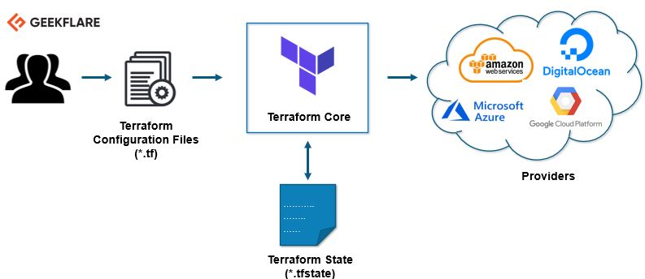

# Terraform

Terraform is an infrastructure provisioning and management tool that allows you to define, deploy, and manage infrastructure resources across different cloud providers. 

It enables you to describe your desired infrastructure state using a  configuration language, which Terraform then translates into API calls to create and modify resources. With Terraform, you can easily automate the provisioning and configuration of virtual machines, storage, networks, and more. It provides a unified workflow, version control, and the ability to track and manage infrastructure changes. 

**Terraform helps achieve infrastructure as code, making infrastructure deployments reliable, scalable, and repeatable across multiple environments**.