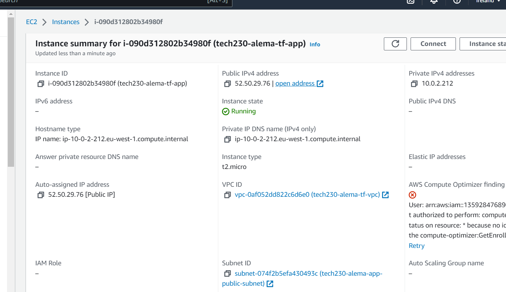
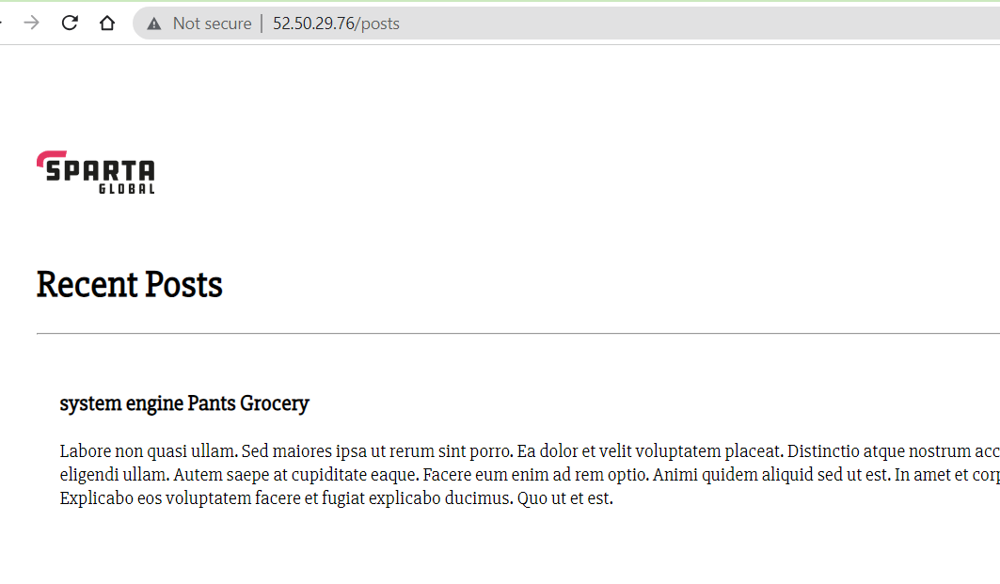
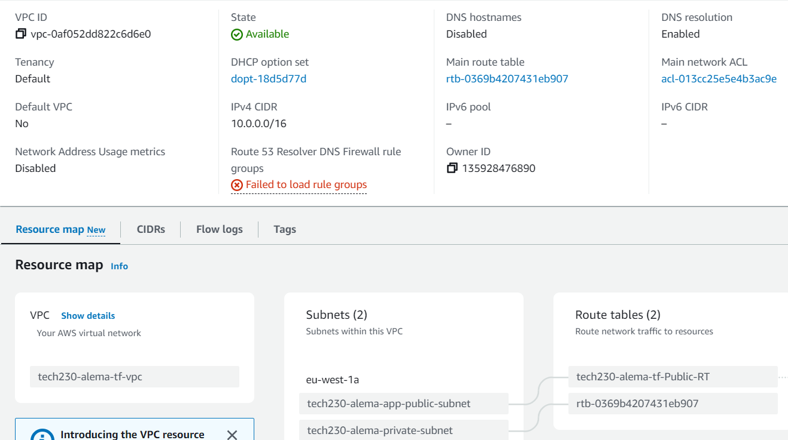

## Using Terraform for the Sparta App

# Provider block specifying the AWS provider and the region
provider "aws" {
  region = "eu-west-1"
}

# Resource block creating an AWS VPC
resource "aws_vpc" "tech230-alema-tf-vpc" {
  cidr_block = "10.0.0.0/16"
  tags = {
    Name = "tech230-alema-tf-vpc"
  }
}

# Making an internet gateway for the VPC
resource "aws_internet_gateway" "tech230-alema-tf-IGW" {
  vpc_id = aws_vpc.tech230-alema-tf-vpc.id
  tags = {
    Name = "tech230-alema-tf-IGW"
  }
}

# Creating a public subnet within the VPC
resource "aws_subnet" "tech230-alema-app-public-subnet" {
  vpc_id            = aws_vpc.tech230-alema-tf-vpc.id
  cidr_block        = "10.0.2.0/24"
  availability_zone = "eu-west-1a"
  map_public_ip_on_launch = true
  tags = {
    Name = "tech230-alema-app-public-subnet"
  }
}

# Creating a private subnet within the VPC (database)
resource "aws_subnet" "tech230-alema-private-subnet" {
  vpc_id            = aws_vpc.tech230-alema-tf-vpc.id
  cidr_block        = "10.0.3.0/24"
  availability_zone = "eu-west-1a"
  tags = {
    Name = "tech230-alema-private-subnet"
  }
}

# Creating a route table for the VPC
resource "aws_route_table" "tech230-alema-tf-Public-RT" {
  vpc_id = aws_vpc.tech230-alema-tf-vpc.id
  route {
    cidr_block = "0.0.0.0/0"
    gateway_id = aws_internet_gateway.tech230-alema-tf-IGW.id
  }
  tags = {
    Name = "tech230-alema-tf-Public-RT"
  }
}

# Associating the route table with the public subnet
resource "aws_route_table_association" "tech230-alema-tf-rt-A" {
  route_table_id = aws_route_table.tech230-alema-tf-Public-RT.id
  subnet_id      = aws_subnet.tech230-alema-app-public-subnet.id
}

# Route all traffic to the internet from RT
resource "aws_route" "tech230-alema-route" {
  route_table_id         = aws_route_table.tech230-alema-tf-Public-RT.id
  destination_cidr_block = "0.0.0.0/0"
  gateway_id             = aws_internet_gateway.tech230-alema-tf-IGW.id
}

# Creating a security group for app
resource "aws_security_group" "tech230-alema-tf-VPC-app-SG-80-22" {
  name        = "tech230-alema-tf-VPC-app-SG-80-22"
  description = "SSH and HTTP traffic"
  vpc_id      = aws_vpc.tech230-alema-tf-vpc.id

  # Ingress rules to allow inbound traffic on specific ports
  ingress {
    description    = "access to the app"
    from_port      = 80
    to_port        = 80
    protocol       = "tcp"
    cidr_blocks    = ["0.0.0.0/0"]
  }

  # Allows SSH access
  ingress {
    description    = "SSH access"
    from_port      = 22
    to_port        = 22
    protocol       = "tcp"
    cidr_blocks    = ["0.0.0.0/0"]
  }

  # Allows port 3000 from anywhere
  ingress {
    from_port   = 3000
    to_port     = 3000
    protocol    = "tcp"
    cidr_blocks = ["0.0.0.0/0"]
  }

  # Allows all outbound traffic
  egress {
    from_port   = 0
    to_port     = 0
    protocol    = "-1"
    cidr_blocks = ["0.0.0.0/0"]
  }
  tags = {
    Name = "tech230-alema-tf-VPC"
  }
}

# Security group for database instance
resource "aws_security_group" "tech230-alema-tf-VPC-DB-SG-27017" {
        name        = "tech230-alema-tf-VPC-DB-SG-27017"
        description = "MongoDB traffic - 27017"
        vpc_id      = aws_vpc.tech230-alema-tf-vpc.id
        tags = {
                Name = "tech230-alema-tf-VPC-DB-SG-27017"
        }

        # Ingress rule to allow MongoDB traffic on port 27017
        ingress {
                from_port   = 27017
                to_port     = 27017
                protocol    = "tcp"
                cidr_blocks = ["0.0.0.0/0"]
        }
}

# Creating MongoDB Instance
resource "aws_instance" "tech230-alema-tf-db" {
        ami                    = "ami-08efbc5208030ef78"
        instance_type          = "t2.micro"
        vpc_security_group_ids = [aws_security_group.tech230-alema-tf-VPC-DB-SG-27017>
        subnet_id              = aws_subnet.tech230-alema-private-subnet.id
        tags = {
                Name = "tech230-alema-tf-db"
        }
        private_ip    = "10.0.3.10"
}

# Adding a time delay
resource "time_sleep" "wait" {
  depends_on = [aws_instance.tech230-alema-tf-db]

  create_duration = "60s"
}

# Creating app instance

resource "aws_instance" "tech230-alema-tf-app" {
	ami                    = "ami-02d66207183be15ad"
	instance_type          = "t2.micro"
	vpc_security_group_ids = [aws_security_group.tech230-alema-tf-VPC-app-SG-80-22.id]
	subnet_id              = aws_subnet.tech230-alema-app-public-subnet.id
	associate_public_ip_address = true
	key_name      = "tech230"
	tags = {
		Name = "tech230-alema-tf-app"
	}

# User data
user_data = <<-EOF
    #!/bin/bash

    sudo apt-get update -y && sudo apt-get upgrade -y

    sudo apt-get install nginx -y

    sudo sed -i "s/try_files \$uri \$uri\/ =404;/proxy_pass http:\/\/localhost:3000\/;/" /etc/nginx/sites-available/default

    sudo sed -i "s/# pass PHP scripts to FastCGI server/location \/posts {\n\t\tproxy_pass http:\/\/localhost:3000\/posts;\n\t}/" /etc/nginx/sites-available/default

    sudo systemctl restart nginx && sudo systemctl enable nginx

    curl -sL https://deb.nodesource.com/setup_12.x | sudo -E bash -

    sudo apt-get install nodejs -y

    sudo npm install pm2 -g

    export DB_HOST=mongodb://10.0.3.10:27017/posts

    git clone https://github.com/Asanjena/app.git /home/ubuntu/app

    cd /home/ubuntu/app

    sudo npm install

    node seeds/seed.js

    pm2 start app.js --update-env

    pm2 restart app.js --update-env
  EOF

  }
}

