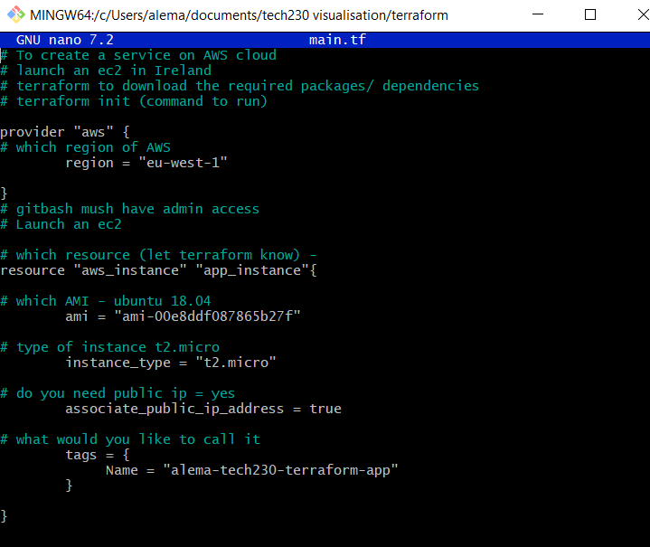
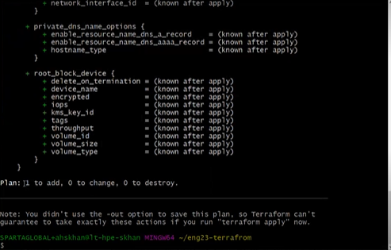
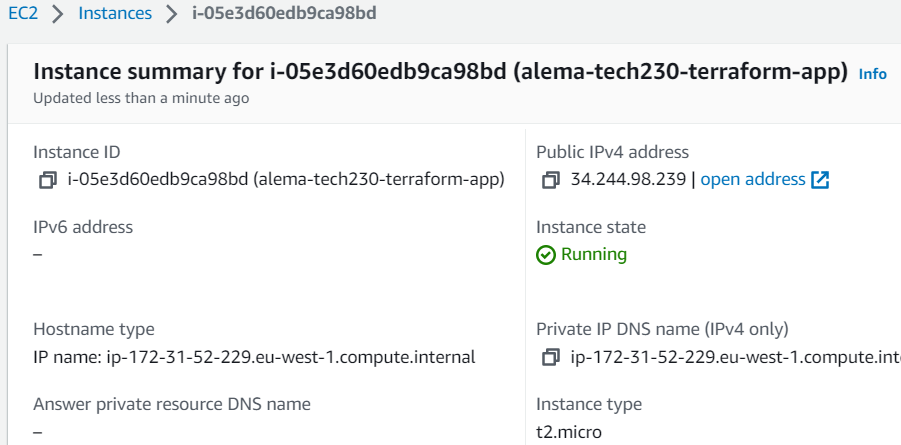
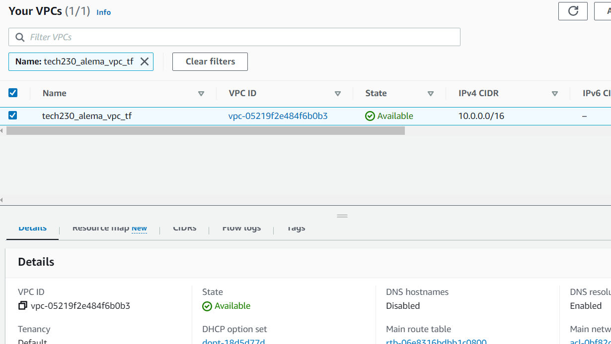

## Downlaoding Terraform

1. You can go online and download terraform for your machine
2. You then need to make an environment variable. Use this guide: https://spacelift.io/blog/how-to-install-terraform

**Note**: You may need to restart you machine after this

3. To check that terraform has downloaded in  git bash terminal (with admin access) type the following commands:

```
terraform
terraform --version
```

## Using Terraform

Here are some commands that are used:

**terraform init** - To initialise terraform

**terraform plan** - This checks your code. If something is wrong, it will inform you

**terraform apply** - This will execute your codes. You will be prompted to enter 'yes' to make sure that you do want to go ahead an execute 

**terraform destroy** - if you have made and instance, it will kill the instance


## Using terraform to make an instance on AWS

1. Create a file:

```
nano main.tf
```

2. Enter the following

```
# To create a service on AWS cloud
# launch an ec2 in Ireland
# terraform to download the required packages/ dependencies
# terraform init (command to run)

provider "aws" {
# which region of AWS
        region = "eu-west-1"

}
# gitbash mush have admin access
# Launch an ec2

# which resource (let terraform know) -
resource "aws_instance" "app_instance"{

# which AMI - ubuntu 18.04
        ami = "ami-00e8ddf087865b27f"

# type of instance t2.micro
        instance_type = "t2.micro"

# do you need public ip = yes
        associate_public_ip_address = true

# what would you like to call it
        tags = {
             Name = "alema-tech230-terraform-app"
        }

}

```

It should look like this:




3. use this command to initialise

```
terraform init
```

4. Use this command to check the contents

```
cat main.tf
```

5. Use the command

```
terraform plan
```
 


6. Then use

```
terraform apply
```

If you go to AWS, you should be able to see your instance starting to iniitialise and run


7. To then kill the instance through terraform (and not mannuallly on AWS), use:

```
terraform destroy
```


Automating the process of making an EC2 instance:

```
# To create a service on AWS cloud
# launch an ec2 in Ireland
# terraform to download the required packages/ dependencies
# terraform init (command to run)

provider "aws" {
# which region of AWS
        region = "eu-west-1"

}
# gitbash mush have admin access
# Launch an ec2

# which resource (let terraform know) -
resource "aws_instance" "app_instance"{

# which AMI - ubuntu 18.04
        ami = "ami-00e8ddf087865b27f"

# type of instance t2.micro
        instance_type = "t2.micro"

# do you need public ip = yes
        associate_public_ip_address = true

# what would you like to call it
        tags = {
             Name = "alema-tech230-terraform-app"
        }
}

# vpc
resource "aws_vpc" "alema_tf_vpc" {
    cidr_block     = "10.0.0.0/16"
    instance_tenancy = "default"

    tags = {

      Name = "tech230_alema_vpc_tf"
    }
}

resource "aws_internet_gateway" "tech230_alema_tf_igw" {
  vpc_id = aws_vpc.alema_tf_vpc.id

  tags = {
    Name = "tech230_alema_tf_igw"
  }
}


resource "aws_subnet" "tech230_alema_tf_vpc_public_sn" {
  vpc_id     = aws_vpc.alema_tf_vpc.id
  cidr_block = "10.0.2.0/24"

  tags = {
    Name = "tech230_alema_tf_vpc_public_sn"
    }
}

resource "aws_subnet" "tech230_alema_tf_vpc_private_sn" {
  vpc_id     = aws_vpc.alema_tf_vpc.id
  cidr_block = "10.0.2.0/24"

  tags = {
    Name = "tech230_alema_tf_vpc_private_sn"
    }
}

resource "aws_security_group" "tech230_alema_sg_app" {
  name        = "tech230_alema_tf_sg_app"
  description = "Allow inbound traffic"
  vpc_id = aws_vpc.alema_tf_vpc.id

  ingress {
    description      = "access to the app"
    from_port        = "80"
    to_port          = "80"
    protocol         = "tcp"
    cidr_blocks      = ["0.0.0.0/0"]

  }
  # ssh access
  ingress {
    description      = "ssh access"
    from_port        = "22"
    to_port          = "22"
    protocol         = "tcp"
    cidr_blocks      = ["<my-ip>/32"] # <my-ip> with actual IP

 }
 # Allow port 3000 from anywhere
  ingress {
    from_port        = "3000"
    to_port          = "3000"
    protocol         = "tcp"
    cidr_blocks      = ["0.0.0.0/0"]

    }

egress {
    from_port        = 0
    to_port          = 0
    protocol         = "-1"
    cidr_blocks      = ["0.0.0.0/0"]
  }

      tags = {
        Name = "tech230_alema_tf_sg_app"
    }
}

# Inbound rule for MongoDB access from private subnet
	ingress {
		from_port   = 27017
		to_port     = 27017
		protocol    = "tcp"
		# specifies private subnet CIDR block for connecting with DB
		cidr_blocks = ["10.0.3.0/24"]
	}

	# Outbound rule allowing all traffic
	egress {
		from_port   = 0
		to_port     = 0
		protocol    = "-1"
    # all access allowed
		cidr_blocks = ["0.0.0.0/0"]
	}
}

# Create security group for DB server
resource "aws_security_group" "tech230-alema-db-sg" {
	name        = "tech230-alema-db-sg"
	description = "SG for MongoDB server"
	vpc_id      = aws_vpc.alema_tf_vpc.id

	# Inbound rule - MongoDB access from app server (public subnet)
	ingress {
		from_port        = 27017
		to_port          = 27017
		protocol         = "tcp"
		cidr_blocks = ["10.0.2.0/24"]
	}

	# Outbound rule allowing all traffic
	egress {
		from_port   = 0
		to_port     = 0
		protocol    = "-1"
		cidr_blocks = ["0.0.0.0/0"]
	}
}

resource "aws_route_table" "tech230_alema_tf_rt" {
vpc_id = aws_vpc.alema_tf_vpc.id

route  {
    cidr_block = "0.0.0.0/0"
    gateway_id = aws_internet_gateway.tech230_alema_tf_igw.id
    }

 tags = {
     Name = "tech230_alema_tf_rt"
  }
}

resource "aws_route_table_association" "tech230_alema_tf_subnet_association" {
  route_table_id = aws_route_table.tech230_alema_tf_rt.id
  subnet_id = aws_subnet.tech230_alema_tf_vpc_public_sn.id
}

```







